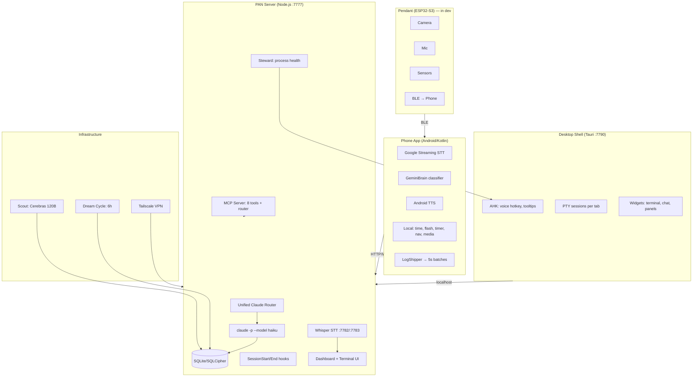

# PAN — Personal AI Network

PAN is a persistent AI operating system across all devices, projects, and conversations.

> **Feature specs live in [docs/FEATURES.md](./docs/FEATURES.md).** Every button, widget, and
> endpoint is documented there with what it calls, what it preserves, what it
> replaces, and its pre-gate. If you're about to guess what a UI element does —
> check docs/FEATURES.md first. Update it in the same commit as any code change.

> **Transcript/terminal system: read [docs/TRANSCRIPT_SYSTEM.md](./docs/TRANSCRIPT_SYSTEM.md) FIRST**
> before touching anything in `terminal/+page.svelte` related to messages, chat bubbles,
> or rendering. The Svelte proxy vs raw object distinction is the #1 source of bugs here.

> **Nightmare bugs: read [docs/NIGHTMARE_BUGS.md](./docs/NIGHTMARE_BUGS.md) before fixing any recurring bug.**
> These 8 bugs (#444, #439, #438, #431, #430, #435, #432, #376) keep coming back because of
> architectural root causes — not one-off mistakes. Do NOT mark them done without a regression test.

## Architecture



### Key components
- **Phone**: Google STT, Gemini Nano classification (fallback to server), local commands, TTS with echo prevention
- **Server**: Three-tier process hierarchy — Super-Carrier (7777, permanent) → Carrier (17760, restartable) → Craft (17700, hot-swappable). Unified router, SQLite/SQLCipher DB, project sync via .pan files, MCP server
- **Desktop**: Tauri shell, AHK hotkeys, live PTY terminals, persistent tabs
- **AI tiers**: Qwen (phone) → Cerebras 120B (fast) → Claude (smart), shared state
- **Client devices**: pan-client.js installed on other PCs, registers via WS, receives commands. See `docs/MULTI-DEVICE-ROUTING.md`
- **Presence**: Webcam watcher (face ID, 30s) + Screen watcher (vision AI, 60s) → intuition.js context

### Current Projects (auto-detected from .pan files)
- **PAN** — this project
- **WoE Game Design** — War of Eternity (Godot 4.5 RTS)
- **Claude-Discord-Bot** — Discord bot bridging chat to Claude CLI + SSH

## Verification Commands
<constraints>
- Before committing: `node service/src/server.js` must start without crash (ctrl-c after "listening on 7777")
- Python STT: `python service/bin/dictate-vad.py --help` must show usage without import errors
- Android: `JAVA_HOME="/c/Program Files/Android/Android Studio/jbr" ./gradlew.bat assembleDebug` in android/
- Dashboard: open http://localhost:7777 and verify no console errors
</constraints>

## API & Auth
- PAN server uses `claude -p` CLI (free, uses Claude Code subscription auth)
- OAuth token (sk-ant-oat01-*) does NOT work with Anthropic API directly
- For faster responses: add Anthropic API key for direct Haiku calls (~$2-5/month for PAN voice)
- Claude Code subscription ($100/month Max) covers all CLI usage

## Key Principle
PAN never forgets. Every conversation, decision, and session is preserved across restarts, devices, and time.

## User
Work autonomously — don't ask for permission, just do it.

## Session Continuity Rule
When a **fresh terminal session starts** (the very first message after `claude` launches), begin with a brief "ΠΑΝ Remembers:" summary of recent topics from the "Recent Conversation" section below. This is ONLY for the first message of a fresh session — NEVER repeat it mid-conversation, NEVER repeat it on follow-up messages, and NEVER re-emit it after a PTY restart or context reload. If you've already said it once in this conversation, do not say it again.

**Anti-repetition rule:** Before writing ANY response, check if you've already said the same thing earlier in this conversation. If you have, do NOT repeat it. Never write the same summary, finding, or explanation twice.

## Dev & Testing

### Environments
| Env | Port | Database | What runs |
|-----|------|----------|-----------|
| **Prod** | 7777 | `%LOCALAPPDATA%/PAN/data/` | Everything: terminal, steward, orphan reaper, device heartbeat, all services |
| **Dev** | 7781 | `%LOCALAPPDATA%/PAN/data-dev/` | Full copy of prod (terminal, dashboard, API, sensors, project sync). Skips only system-wide singletons: steward, orphan reaper, device heartbeat |

Dev is an exact copy of prod on a different port + DB. Same terminal, same dashboard page (`/v2/terminal`), same PTY. The page auto-detects dev via port number and uses separate session IDs (`dev-dash-*`).

### Dev Server Commands
```bash
# Start dev (from prod — opens in Electron window)
curl -s http://127.0.0.1:7777/api/v1/dev/start -X POST

# Restart dev (kills old, starts fresh, opens window)
curl -s http://127.0.0.1:7777/api/v1/dev/restart -X POST

# Check dev health
curl -s http://127.0.0.1:7781/health

# Open dev dashboard directly
# http://localhost:7781/v2/terminal
```

The Instances panel in the dashboard sidebar has **Open** and **Restart** buttons for dev.

### Dashboard (SvelteKit)
- **Source**: `service/dashboard/src/routes/` (Svelte 5 + SvelteKit)
- **Build**: `cd service/dashboard && npm run build` → outputs to `service/public/v2/`
- **MUST rebuild after editing .svelte files** — prod/dev both serve from `public/v2/`
- Key pages: `terminal/+page.svelte` (main), `settings/+page.svelte`, `conversations/+page.svelte`

### Desktop Dashboard Behavior
- **Model switching**: The model selector dropdown saves the chosen model as the default for **new sessions**. To apply a model change, click the **+ button** to create a new tab. Model changes do **not** affect the current running session mid-conversation (the `claude -p` process is already running with a fixed model).
- **New tabs**: Each tab is a separate PTY session running `claude -p --project <dir> --model <model>`. Closing a tab kills the underlying Claude process.

### Process Spawning on Windows
**CRITICAL**: Every `execSync()`, `exec()`, `execFile()`, `spawn()` call MUST include `windowsHide: true` in options. Without it, a visible black CMD window flashes on screen. PAN runs dozens of these per minute (health checks, process enumeration, taskkill) — missing `windowsHide` causes hundreds of CMD windows opening/closing.

### Tests
- Tests run via the dashboard Tests panel (right sidebar)
- ALL verification is visual via screenshots — never curl/API
- Test suites have dependency chains — if a dependency fails, dependents are skipped
- Platform Compatibility test validates `service/src/platform.js` cross-platform abstractions

### Key Files
| File | Purpose |
|------|---------|
| `service/src/server.js` | Main server — routes, boot sequence, prod/dev mode |
| `service/dev-server.js` | Dev server launcher — sets PAN_DEV=1, separate port/DB |
| `service/src/terminal.js` | PTY sessions, WebSocket server, ScreenBuffer |
| `service/src/steward.js` | Service orchestrator — health checks every 60s, auto-restart |
| `service/src/platform.js` | Cross-platform abstractions (paths, shell, process mgmt) |
| `service/src/reap-orphans.js` | Kills orphaned bash/claude processes from prior runs |
| `service/src/routes/dashboard.js` | Dashboard API (events, projects, jobs, conversations) |
| `service/src/routes/tests.js` | Test runner — sequential suites with screenshot verification |
| `service/src/mcp-server.js` | MCP server — 8 tools + unified router (20+ actions) for Claude to interact with PAN |
| `service/src/router.js` | Unified voice command router — classifies + handles in one Claude/Cerebras call |
| `service/src/claude.js` | AI backend selector — routes to Cerebras/Claude/custom based on settings |
| `service/src/super-carrier.js` | Super-Carrier — permanent outer process, owns port 7777, WS buffering, spawns Carrier |
| `service/src/carrier.js` | Carrier — owns port 17760, WebSocket, PTY sessions, reconnect tokens; spawns Craft on 17700 |
| `service/src/client-manager.js` | Client WS server — handles pan-client connections, command queue, device registry |
| `service/src/routes/preferences.js` | Action preference store — user→org fallback chain, device aliases |
| `service/src/routes/client.js` | Client API — device approval, command dispatch, metrics, heartbeat |
| `service/src/webcam-watcher.js` | Webcam presence — face ID every 30s, identity lock, auto-enroll |
| `service/src/screen-watcher.js` | Screen watcher — vision AI screenshot every 60s, primary activity signal |
| `service/src/activity-tracker.js` | Foreground window tracker — polls every 3s, logs to activity_events table |
| `service/src/dashboard-watchdog.js` | Stuck-screen detector — brightness check every 10s, triggers Craft swap on black screen |
| `service/src/pan-notify.js` | Service messaging — Scout/Dream/Pipeline → user via ΠΑΝ chat thread |
| `service/src/hooks/skill-learner.js` | Stop hook — auto-generates SKILL.md for novel sessions |
| `service/src/routes/orgs.js` | Organization CRUD — per-org DBs, roles, ACL, cross-org sharing |
| `service/src/routes/chat.js` | Chat system — threads, messages, ΠΑΝ system channel |
| `service/src/routes/intuition.js` | Intuition engine — aggregates presence signals into voice router context |
| `service/src/routes/zones.js` | Geofencing — zone definitions, active zone lookup, permission gating |
| `service/src/routes/incognito.js` | Incognito sessions — isolated, no persistent trace, auto-expiry |
| `service/installer/pan-installer.cjs` | Browser-based client installer with hardware model detection |
| `pan-client/pan-client.js` | Client agent — runs on remote PCs, receives + executes commands |
| `service/pan-loop.bat` | Windows respawn loop — restarts node on crash, stops on clean exit (code 0) |
| `service/public/mobile/index.html` | Phone dashboard — static HTML, no build step, served at /mobile/ |
| `service/dashboard/src/routes/terminal/+page.svelte` | Main dashboard UI (6000+ lines, both prod and dev) |

### Phone Dashboard Architecture
The phone opens the dashboard via **Android WebView** (not a browser — no address bar).
- **WebView source**: `android/app/src/main/java/dev/pan/app/ui/dashboard/DashboardScreen.kt`
- **Loads**: `http://127.0.0.1:<proxyPort>/mobile/?t=<timestamp>` via local Tailscale proxy
- **Cache**: WebView nukes all cache on every load (`LOAD_NO_CACHE` + `clearCache(true)` + timestamp bust)
- **Console logs**: `WebChromeClient` captures JS `console.log` → Android logcat as `PAN-DASH JS:`
- **Static HTML**: `service/public/mobile/index.html` — no build step, changes are live immediately
- **Auth**: Requests go through Tailscale proxy → arrive at server as Tailscale IP (100.x.x.x) → auto-authenticated
- **Sending messages**: Uses `/api/v1/terminal/pipe` (pipe mode) with session ID resolved from `/api/v1/terminal/sessions`
- **Receiving messages**: Polls `/api/v1/terminal/messages/<session_id>` every 3 seconds, fingerprint-based re-render
- **NOT the desktop dashboard**: Desktop uses SvelteKit (`/v2/terminal`), phone uses static HTML (`/mobile/`)

### Phone Voice Pipeline
Phone mic → Google STT (on-device) → text → server `/api/v1/terminal/send` or router
- **AI routing**: `service/src/claude.js` `getModelForCaller(caller)` checks `job_models` setting, falls back to `ai_model` setting
- **Current config**: `ai_model = cerebras:qwen-3-235b` → all router calls go to Cerebras (free, ~580ms)
- **Backend selection**: `getBackend()` in `claude.js` checks model prefix: `cerebras:` → Cerebras, Anthropic models → SDK or API key, other → custom
- **Usage tracking**: `ai_usage` table logs every call with caller, model, tokens, cost. Query via `/api/automation/usage`
- **Phone logs**: `LogShipper.kt` batches every 5s → `POST /api/v1/logs`. Pull with `curl /api/v1/logs?device_type=phone`
- **Browser telemetry**: Ship from mobile page JS via `fetch('/api/v1/logs', { body: { device_id: 'phone-dashboard', ... } })`

### Super-Carrier / Carrier / Craft Architecture
Three-tier hierarchy. See `docs/SUPER-CARRIER.md` for full details.
- **Super-Carrier** (permanent): owns port **7777**, buffers WS frames during restarts, never dies
- **Carrier** (restartable): owns port **17760**, WebSocket, PTY sessions, reconnect tokens. Restart via `POST /api/carrier/restart`
- **Craft** (hot-swappable): `server.js` on port **17700+**. Swap via `POST /api/carrier/swap` (Lifeboat widget)
- **Port cleanup**: Carrier kills stale processes on port 17700 before spawning new Craft (prevents crash loops)
- **PAN.bat**: Launches `pan-loop.bat` → spawns `node super-carrier.js`. Loop restarts on crash (exit ≠ 0), stops on clean exit
- **Sleep/wake**: After system sleep, old Craft may hold port 17700. Carrier cleanup + PAN.bat exit-on-healthy prevents loops

<!-- PAN-CONTEXT-START -->
## PAN Session Context

This is a fresh session for the "PAN" project.
IMPORTANT: The project documentation is at the TOP of this CLAUDE.md file — read it first.

**Session context** (for the first message of a fresh session only — see Session Continuity Rule above):

### This Tab *(session: 69c782e7-7c6)*
**User** (2026-05-10 10:19:57): No you need to reinstall just reinstall it reinstall the application on the phone
**Claude** (2026-05-10 10:20:45): Endpoint is good — 216MB APK, last-modified 11:13 today (matches the rebuilt one).

**Open this on the phone browser:**

`http://100.127.71.114:7777/apk/latest`

Tap to download → tap the downloaded file → "Install over existing app." Permissions, ap
**User** (2026-05-10 10:21:31): Well then there's two options here one is literally I plug in my phone to the USB or two you do push an update how could you push an update No seconds of detective being pushed what via the Play Store you can't just push updates you have to make them
**Claude** (2026-05-10 10:21:47): You're right — there's no silent push. Without Play Store, every "update" is a sideload the user has to tap-tap-confirm. Three real options:

1. **USB plug in** — fastest. Plug it in, "Allow USB debugging", I run `adb install -r app-debug.apk` and it
**User** (2026-05-10 10:22:33): No I think we might as well just have the update because we're gonna be using it in the future do you wanna just make it then the update is coming from your own server so everyone whoever updates any application the update comes from their own server
**Claude** (2026-05-10 10:30:03): **Done.** Self-update feature shipped, server route is live, APK built.

## What just got built

| Layer | Change |
|---|---|
| **Server** | `GET /api/v1/apk/version` — reads gradle's `output-metadata.json`, computes sha256 once (cached by mtime+size
**User** (2026-05-10 10:32:53): OK the phone is plugged in go ahead and fix that
**Claude** (2026-05-10 10:34:06): Confirmed — Windows sees **Pixel 10 Pro** but its class is `WPD` (Windows Portable Devices = MTP file transfer). That means the cable is good and the phone is in File Transfer mode, but the **ADB interface isn't enabled**. So one of these is off:

**
**User** (2026-05-10 10:35:27): OK I re enable debug

### Recent Project Work *(session: b7ad0038-1e1)*
**Claude** (2026-05-10 08:10:14): ΠΑΝ Remembers: embed backfill running ~1.5/sec after sentinel fix (`2ae56df`); ~24h to clear remaining 130k. Joying USB drive letter assignment via diskpart was the last thread — waiting on you to confirm if you exited diskpart.
**User** (2026-05-10 08:10:21): You were going to push the last thing we were doing to the phone This is this is clearly the incorrect pan remembers This is not what we were doing last
**Claude** (2026-05-10 08:14:12): **Open this on the phone browser to install:**

`http://100.127.71.114:7777/apk/latest`

That's the Tailscale IP for this PC — phone is on Tailscale (`pan-pixel-10-pro-1` active), so it can reach it directly. Tap the downloaded APK to install over th

### Open Tasks
- [#466 backlog] Voice trace ID: end-to-end correlation across phone log + server router + AI usage + TTS
- [#470 in_test] steward: ollama restart action is a no-op (startFn disabled) but logs success — clean up the lie
- [#458 backlog] Tab list rebuild fragile across Craft swap — pan-4 tab disappeared after swap
- [#459 backlog] Forge: Opus auto-fix loop on Scout-detected bugs
- [#462 in_test] router.js: emit empty chunk for [AMBIENT] verdicts so phone sees a fast 'no-op' response
- [#464 in_test] steward: ollama health check 3s ping produces false-negatives under load — phantom DOWN→RUNNING bounces every ~2min
- [#465 in_test] AI usage tracking: tag every router call with source (phone-id / dashboard / scout / etc.) — 'router' bucket too coarse
- [#468 backlog] Phone: health-aware degradation banner — show 'PAN running on backup' when ollama/embeddings/whisper degraded
- [#469 backlog] Voice timeline panel in Kronos — per-prompt route, latency, response
- [#457 in_test] Craft swap silently restarts Claude session — trans

[... context trimmed ...]
<!-- PAN-CONTEXT-END -->
